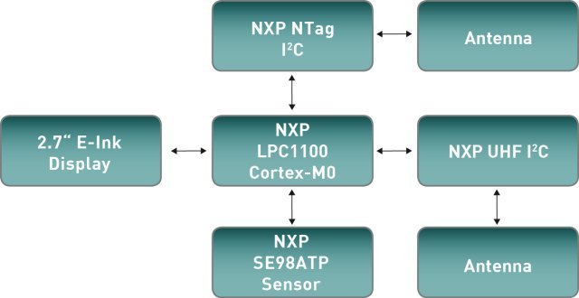

Board
=====

Schema
------

The Louvre board demo is fitted with these devices:

- NXP Cortex M0 LPC11U37 Microcontroller
- SE98ATP temperature sensor
- NXP NTAG: The NTAG family has been developed by NXP Semiconductors as standard NFC tag ICs to be used in mass market applications such as retail, gaming and consumer electronics, in combination with NFC devices or NFC compliant Proximity Coupling Devices.
- 2.7” E-Ink EM027BS013 from Pervasive Displays: The 2.7" panel has resolution of 264 x 176 (117 dpi).
- NXP UHF. not used by firmware

- miniusb: used to power supply the board (see demo 2)
- jumper CN4: used for boot mode of the LPC11U34 (see upgrade section)

To download the schematics please visit `architechboards Louvre <http://architechboards.org/product/louvre-board>`_ webpage. 
