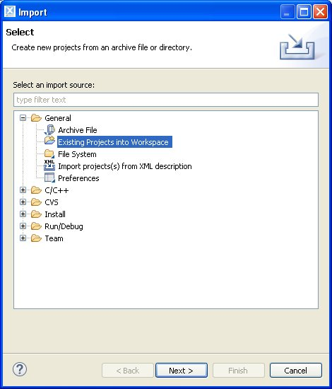
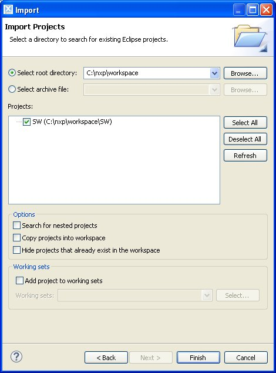
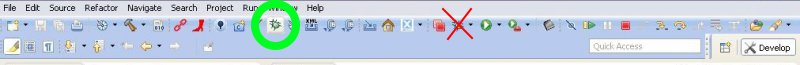
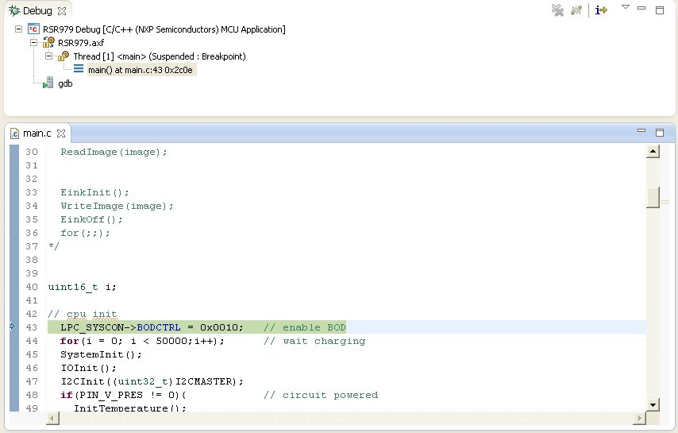

.. _development:

Development
===========

To develop on Louvre board are required:

- software:
	- LPCXpresso
	- firmware source

- hardware:
	- Louvre Board
	- NXP LPC-Link, please refer to `embeddedartists <http://www.embeddedartists.com>`_ website. In this guide we have used LPC-Link 1 of this `board <http://www.embeddedartists.com/products/lpcxpresso/lpc11U24_xpr.php>`_ not the LPC-Link 2.

Download LPCExpresso
--------------------

The developement software used is LPCxpresso, we suggest to install at the least version 7.3.
This application is freely downloadable from lpcware site. Go to `lpcxpresso <http://www.lpcware.com/lpcxpresso/downloads/windows>`_ webpage
Install the LPCxpresso following default procedure. In this guide the SDK is installed in the default path *C:\\nxp* and we refer to this in our example.
After the installation you need to register in order to activate the **Free Edition** of the LPCXpresso.
Launch the SDK selecting as workspace folder *C:\\nxp\\workspace*.

.. image:: _images/sdk_workspace_path.jpg

Select from menu *Help -> Activate -> Create serial number and register (Free Edition)*. Check the options *Open in external browser* and *Copy Serial Number to clipboard* then press *Ok* button.

.. image:: _images/sdk_serial_number.jpg

From the website you need to register and insert the serial number. It will display your activation code.

.. image:: _images/sdk_register_serial_number.jpg

The activation code must be inserted into the window-form selectionable from the menu *Help -> Activate -> Activate (Free Edition)*

.. image:: _images/sdk_window_form.jpg

If all is done correctly now you are able to deploy with the Free Edition LPCXpresso, permitting you to debug up to 256KB.

Environment Setup
-----------------

To get the source of the firmware, you need to register to architechboards website.
This site provides software and documentation needed to develop with the Louvre board. Save it in your bookmarks to be updated with the new releases.
In the homepage select the **Louvre board** in the **Products** menu. In this page you can find the download link.
Once got the firmware source, unpack it into *C:\\nxp\\workspace* folder.

Import Project
--------------

After unpacked the source code you have to import the project. Select from the menu *File -> Import* and before to press *Next* button select *Existing project into Workspace*.

Choose root directory as *C:\\nxp\\workspace* and select *C:\\nxp\\workspace\\SW* project. Then press *Finish* button.

Debug Project
-------------

Before you start a debugging session make sure that you have connected the LPC-Link to PC. Connect with a cable the **J4** LPC-Link connector to the **CN3** connector of the Louvre board.
Here the connection scheme:

====== =======
pin J4 pin CN3
====== =======
2      2
3      4
6      1
8      3
====== =======

To debug the project you need to build it, from the menu go to *Project -> Build All*. The console window will display the compilation.

.. image:: _images/sdk_console_compilation.jpg

Then click on the "bug" icon, be careful, the right bug is that on the left!

The debug will start.

Firmware Details
----------------

| All libreries code used is been imported directly into the project: i2c.c, ssp.c, gpio.c, timer.c and adc.c. The file adc.c is not used. 
| The code for the e-ink is in the modules eink.c and fonts.c. 
| The module driver.c is for manage temperature sensor, capacitive buttons and nfc protocol.
| To have more details, the source code is provided with comments.
|

Bootloader
----------

The bootloader is the first program executed, located at the first two blocks of the flash memory (**0x0000 - 0x1FFF**) for a total size of **2K** bytes.
Its work is controlling first the presence of a NFC segnal; if it so, it verifies if there is a new program to load and memorize it in flash; otherwise it checks the presence of a valid applicative program in the flash memory and if it so, copies in ram memory (**0x10000000 - 0x100000bf**) the applicative interrupt vectors and lauches it. If the application is not valid then it checks continuosly NFC signal and it waits a new program to download.

| **Flash memory map:**
| **0000 00BF**  bootloader code vector table
| **00C0 1FFB**  bootloader code                                                                                                                     
| **1FFC 1FFF**  software version
|
| **Ram memory map:**
| **0x10000000 0x100000BF** applicative interrupt vectors table
| **0x100000C0**            bootloader/applicative ram memory
|
| **Applicative:**
| **Flash memory map:**
| **2000 2003** applicative checkusm (used by bootloader to verify the code)
| **2004 2007** applicative lenght
| **2008 200B** applicative version
| **200C 20BF** applicative code vector table (will be copied in the ram memory)
| **20C0**      applicative code
| 
| **Ram memory map:**
| **0x10000000 0x100000BF** applicative interrupt vectors table
| **0x100000C0**            ram memory
|

.. important::

 | Due to the optimization, it is not possible debugging the bootloader

