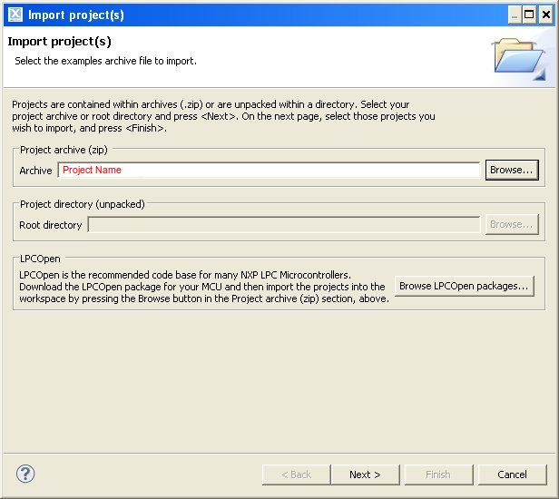

.. _development:

Development
===========

To develop on Louvre board are required:

- Software:

  - LPCXpresso

  - Application firmware project, compatible with bootloadaer

  - Bootloader firmware project

- Hardware:

  - Louvre Board

  - NXP LPC-Link (version 1 or 2), please refer to `embeddedartists <http://www.embeddedartists.com>`_ website. In this guide we have tested both the LPC-Link 1 of this `board <http://www.embeddedartists.com/products/lpcxpresso/lpc11U24_xpr.php>`_ and the LPC-Link 2.

Download LPCExpresso
--------------------

The developement software used is LPCxpresso, we suggest to install at the least version 7.3.
This application is freely downloadable from lpcware site. Go to `lpcxpresso <http://www.lpcware.com/lpcxpresso/downloads/windows>`_ webpage
Install the LPCxpresso following default procedure. In this guide the SDK is installed in the default path *C:\\nxp* and we refer to this in our example.
After the installation you need to register in order to activate the **Free Edition** of the LPCXpresso.
Launch the SDK selecting as workspace folder *C:\\nxp\\workspace*.

.. image:: _images/sdk_workspace_path.jpg

Select from menu *Help -> Activate -> Create serial number and register (Free Edition)*. Check the options *Open in external browser* and *Copy Serial Number to clipboard* then press *Ok* button.

From the website you need to register and insert the serial number. It will display your activation code.

.. image:: _images/sdk_register_serial_number.jpg

The activation code must be inserted into the window-form selectionable from the menu *Help -> Activate -> Activate (Free Edition)*

.. image:: _images/sdk_window_form.jpg

If all is done correctly now you are able to deploy with the Free Edition LPCXpresso, permitting you to debug up to 256KB.

Firmware Projects
-----------------

.. warning::

 | Temporarily please download the bootloader firmware source from "Louvre Board - All Documents and Software in one place" on `the architechboards website <http://architechboards.org/product/louvre-board>`_ section **Downloads Louvre Board -> Software**

To get the last source of the firmware and bootloader, go to `architechboards website <http://architechboards.org/product/louvre-board>`_.
This site provides software and documentation needed to develop with the Louvre board. Save it in your bookmarks to be updated with the new releases.
In the homepage select the **Louvre board** in the **Products** menu.

.. _application_firmware:

Application Firmware
^^^^^^^^^^^^^^^^^^^^

This is the software which permits to the Louvre to retrieve the images on the Louvre board via the Android application called :ref:`image_application` and run the :ref:`power_mode` interface.

**Import Application Project**

You can import the project directly from the packed file downloaded before. In order to do this, press on *Import Project*:

Then browse and select the **ArchiTech_Louvre_Firmware.zip** file, click on *next* button:

Select all and click another time on *next* button:

.. image:: _images/import_2.jpg

Now you have the project loaded:

Project files will be moved under the workspace directory.

Download into Louvre
^^^^^^^^^^^^^^^^^^^^

In order to download the firmware into Louvre board you have to:

1. Recompile the **Louvre Firmware Update** Android application with the firmware.hex file built previously. You can find the source project on `github <https://github.com/architech-boards/louvre-firmware_update.git>`_.
To change the downloaded firmware, the file *firmware.hex* must be changed under the `this folder <https://github.com/architech-boards/louvre-firmware_update/tree/master/app/src/main/res/raw>`_.

2. Use the :ref:`firmware_application` to upload the Louvre board.

.. note::

  It is not possible debug the application due the relocation memory in order to be compatible with the bootloader firmware.

**Firmware Details**

 | All libreries code used is been imported directly into the project: i2c.c, ssp.c, gpio.c, timer.c and adc.c. The file adc.c is not used. 
 | The code for the e-paper is in the modules eink.c and fonts.c. 
 | The module driver.c is for manage temperature sensor, capacitive buttons and nfc protocol.
 | To have more details, the source code is provided with comments.
 |

.. _bootloader_firmware:

Bootloader Firmware
^^^^^^^^^^^^^^^^^^^

.. warning::

 | Temporarily please download the bootloader firmware source from "Louvre Board - All Documents and Software in one place" on `the architechboards website <http://architechboards.org/product/louvre-board>`_ section **Downloads Louvre Board -> Software**

This is the software which permits to the Louvre to retrieve a newer :ref:`application_firmware` via the Android application called :ref:`firmware_application`.

**Import Bootloader Project**

You can import the project directly from the packed file downloaded before. In order to do this, press on *Import Project*:

Then browse and select the **ArchiTech_Louvre_Boot_Firmware.zip** file, click on *next* button:

Select all and click another time on *next* button:

.. image:: _images/import_2.jpg

Now you have the project loaded:

Project files will be moved under the workspace directory.

.. important::

 | Before proceed, copy (from the *bootloader source project*, in the folder *padto*) the **padto.exe** file under the path:
 | *C:\\nxp\\LPCXpresso_7.6.2_326\\lpcxpresso\\bin*

Download into Louvre
^^^^^^^^^^^^^^^^^^^^

Once you have compiled the project you have the **firmware.bin** file outupt into *debug* folder.
To upload it in the Louvre board you have two choice. **The first, the easiest** is with mini-USB cable:

1. Check the jumper **CN4** is setted correctly:

.. image:: _images/louvre_boot_jumpers.jpg

2. it's insert mini-usb cable from PC to the **CN1** connector of the board.

.. image:: _images/louvre_usb.jpg

3. The PC will see the Louvre board as a storage memory, delete the old **firmware.bin** file and copy the newer **firmware.bin** file into the mass storage.

**The second choice** is using the **LPC-Link 1** or **LPC-Link 2**:

- **LPC-Link 1**

1.  make sure that you have connected the LPC-Link to PC. Connect with a cable the **J4** LPC-Link connector to the **CN3** connector of the Louvre board.
Here the connection scheme:

====== ======= ===============
pin J4 pin CN3 Signal Names
====== ======= ===============
3      2       JTAG_TMS_SWDIO
5      4       JTAG_TCLK_SWCLK
11     1       JTAG_RESET
15     3       GND
====== ======= ===============

2. To Flash the project you need to build it, from the menu go to *Project -> Build All*. The console window will display the compilation.

3. Then click on the *processor* icon.

- **LPC-Link 2**

1. Connect **LPC-Link 2** with the pc

.. note:: 

  **LPC-Link 2** can draws a significative amount of current from the usb. The best solution is to connect LPC-Link 2 to a powered hub.

2. If drivers are required choose the automatic sequence of installation

3. Connect LPC-Link 2 with the target with a cable the **J4** LPC-Link connector to the **CN3** connector of the Louvre board.
Here the connection scheme:

=========== ======= ===============
pin J4      pin CN3 Signal Names
=========== ======= ===============
2           2       JTAG_TMS_SWDIO
4           4       JTAG_TCLK_SWCLK
10          1       JTAG_RESET
3 or 5 or 9 3       GND
=========== ======= ===============

4. Open LPCXpresso and load the project then *run->debug configurations*, select *debugger* tab

5. On *emulator selection* voice choose *Redlink server*

6. Click *Apply* and *Close* buttons, then click on the *processor* icon:

**Bootloader Details**

The bootloader is the first program executed, located in the first two blocks of the flash memory (**0x0000 - 0x1FFF**) for a total size of **8K** bytes.
It controls the presence of a NFC segnal with a new valid application; if so, received data are written in flash. After, it calculates the validity of the CRC flash memory, if it is valid then copies the applicative interrupt vectors ram memory (**0x10000000 - 0x100000bf**) and launches it. If the application is not valid then it checks continuosly NFC signal waiting a new program to download.

 | **Flash memory map:**
 | **0000 00BF**  bootloader code vector table
 | **00C0 1FFB**  bootloader code                                                                                                                     
 | **1FFC 1FFF**  software version
 |
 | **Ram memory map:**
 | **0x10000000 0x100000BF** applicative interrupt vectors table
 | **0x100000C0**            bootloader/applicative ram memory
 |
 | **Applicative:**
 | **Flash memory map:**
 | **2000 2003** applicative checkusm (used by bootloader to verify the code)
 | **2004 2007** applicative lenght
 | **2008 200B** applicative version
 | **200C 20BF** applicative code vector table (will be copied in the ram memory)
 | **20C0**      applicative code
 | 
 | **Ram memory map:**
 | **0x10000000 0x100000BF** applicative interrupt vectors table
 | **0x100000C0**            ram memory
 |

.. important::

 | - Due to the optimization, it is not possible debugging the bootloader
 | - You can get the info about the protocol used by bootloader from `ArchiTech website <http://architechboards.org/product/louvre-board/>`_, the document is named **LouvreBoootloaderProtocol.pdf**

