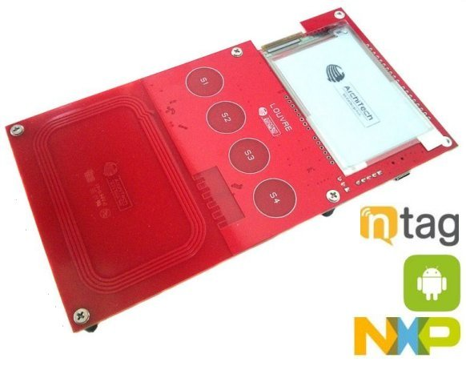

Welcome to Louvre Board's documentation!
========================================

:Version: 1.0.0I
:Copyright: (C)2014 Silica an Avnet company
:Date: 11 May 2015

.. index:: Introduction

Introduction
============

**Silica Louvre board** is an useful product to evaluate the capabilities of **NFC** with **NXP** technology.
The Louvre board doesn't have any battery; when needed the power is supplied exclusively from the NFC antenna.
The firmware provided will show the operation:

  | ° **Powerless Mode** with two possible applications:

    1. Display will show a picture updatable via smartphone, see in :ref:`image_application`

    2. LPC11U37 firmware can be updated via smartphone, see in :ref:`firmware_application`

  | ° **Power Mode**:

    | User interface will be displayed on e-paper when connected to USB (only as power source), see in :ref:`power_mode`

        - Showing sensor data

        - (S1, S2, S3, S4) will show the last touched capacitive buttons

In this documentation we show step by step the features of the firmware and how debug it.

.. note::

 If you want quickly see how the demos work, go here :ref:`quick`!

| For board schematics and source code go to `ArchiTech website <http://architechboards.org/product/louvre-board>`_.
|

**General Description**

* Small form factor
* NXP NTAG I2C
* NXP Cortex M0 LPC11U37 Microcontroller
* 2.7 e-paper display
* SE98ATP temperature sensor
* Mini-USB connector
* Possibility to operate without battery
* Full size antenna to maximize energy harvesting
* Four capacitive buttons to enable user interaction

.. index:: Contents

Contents:

.. toctree::
   :maxdepth: 3

   quick
   development
   board
   appendix

