.. _quick:

Quick start guide
=================

In this page it is showed the unboxing of the Louvre and how to use the board with its software.

.. warning::

	The applications have been tested with a nexus 5.

Unboxing
--------

The product is supplied with the box like this:

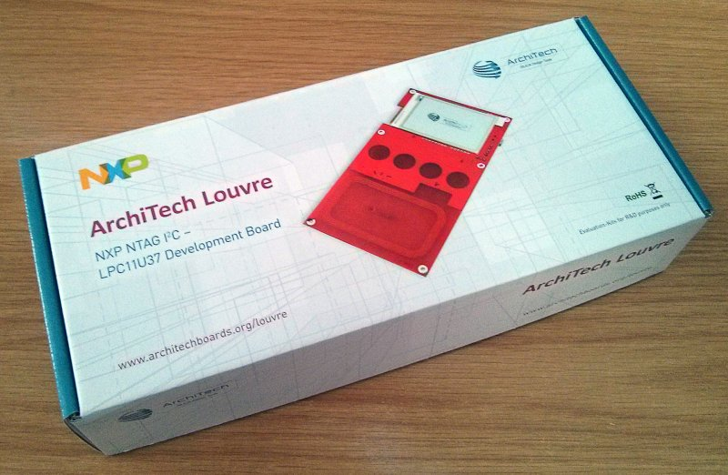

And this is the content of box:

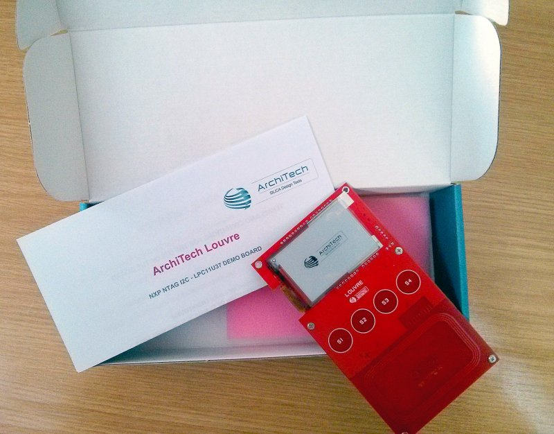

.. note::

  The board itself has been programmed with the :ref:`bootloader_firmware` and the :ref:`application_firmware`.

The board can run two possible modalities:

- :ref:`power_mode`: it runs supplied by mini-USB cable

- :ref:`powerless_mode`: it runs supplied by NFC antenna

.. _power_mode:

Power mode
----------

In order to run the **Power mode** interface it is needed supply the board via a mini usb cable:

1. Check the jumper **CN4** is setted correctly:

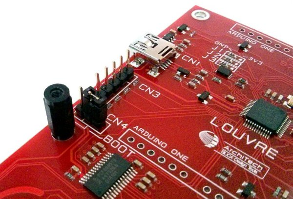

2. Insert mini-USB cable from PC to the **CN1** connector of the board.

.. image:: _images/louvre_usb.jpg

3. The Louvre display on the e-paper screen the temperature read from **SE98ATP** sensor and the last capacitive button pressed.

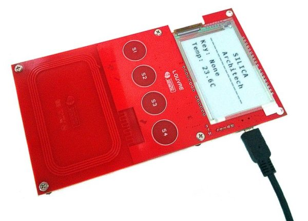

4. If you press a capacitive button **S1**, **S2**, **S3** or **S4** this will displayed on the screen.

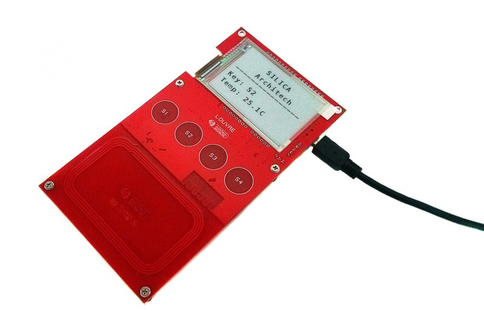

.. _powerless_mode:

Powerless Mode
--------------

The powerless mode works with two different Android applications:

  - :ref:`image_application`: it sends images to the Louvre and the board will show them.

  - :ref:`firmware_application`: it sends a newer :ref:`application_firmware` to the Louvre board.

.. _image_application:

Louvre Image Sender
^^^^^^^^^^^^^^^^^^^

With this application :

- use **NFC** to store an image on the **NTAG IIC** nonvolatile memory mounted on the Louvre board

- using power harnessed from the **NFC** field, the Louvre microcontroller will read the image from **NTAG** using the **IIC** interface and will update the e-paper display

- which shows the image even when the Louvre is not powered up.

.. note::

    - It is required have to enabled the NFC feature on the Android device
    - The source project is downloadable `on github <https://github.com/architech-boards/louvre-image_sender.git>`_

1. Download and install the Android Application via **Google Play Store**, you can use the Qr Code below or search in the `Google Play Store <https://play.google.com>`_ with the name `Louvre Image Sender <https://play.google.com/store/search?q=Louvre%20Image%20Sender>`_.

2. Start the application **LouvreImgSender** on the android device:

3. The application displays the images that you can sent to the Louvre. Select an image do you like:

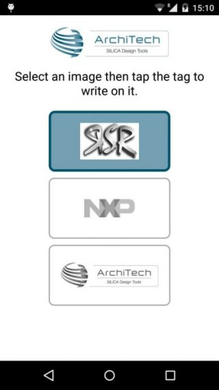

4. Lay down the tablet on the Louvre. The Android device must cover all the antenna area of the Louvre.

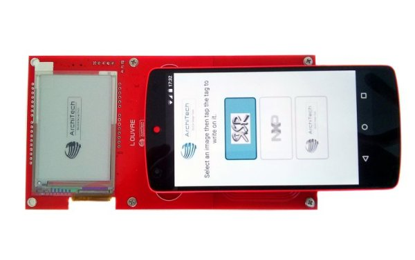

5. The data will be transferred

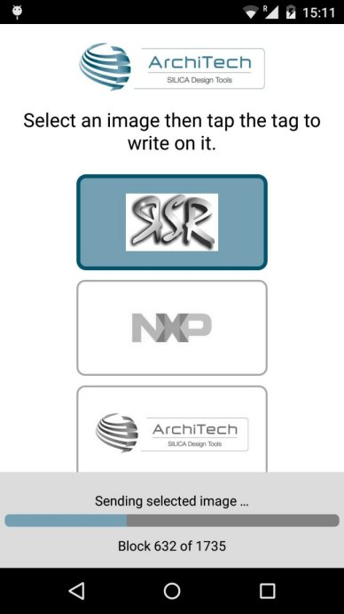

6. Once the data transfer is done a message is reported on the device. Do not remove the device from the Louvre until the e-paper display doesn't show the selected image.

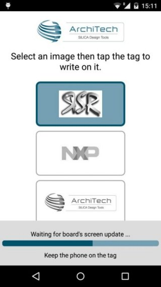

7. Finally the display will show the image selected

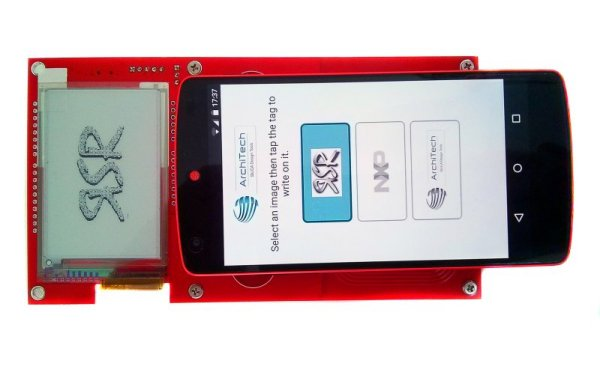

.. _firmware_application:

Louvre Firmware Update
^^^^^^^^^^^^^^^^^^^^^^

With this software a new :ref:`application_firmware` is downloaded and programmed into the Louvre microcontroller, always getting energy only from the NFC.
From this application it is possible also retrieve some tag settings.

.. note::

    - It is required the bootloder installed on the Louvre microcontroller to enable this download even the part is in-field.
    - It is required have to enabled the NFC feature on the Android device
    - The java source project is downloadable on `github <https://github.com/architech-boards/louvre-firmware_update.git>`_

1. Download and install the Android Application via **Google Play Store**, you can use the **QR Code** below or search in the `Google Play Store <https://play.google.com>`_ with the name `Louvre Firmware Update <https://play.google.com/store/search?q=Louvre%20Firmware%20Update>`_.

.. image:: _images/ArchitechLouvreQR.jpg

2. Start the application **LouvreFirmUpdate** on the android device:

3. The application shows the main screen:

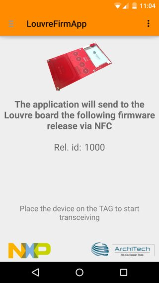

4. Lay down the tablet on the Louvre. The Android device must cover all the antenna area of the Louvre.

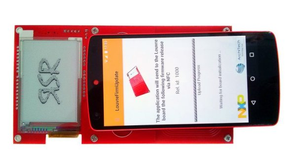

5. The new firmware will be transferred:

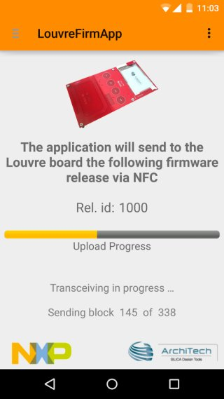

6. Once the firmware transfer is done a message is reported on the device.

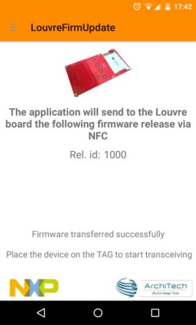

Now the board is programmed with a newer version of the :ref:`application_firmware`. In order to have always the last application firmware, keep updated the **Firmware Download Application** via `Google Play Store <https://play.google.com>`_.

