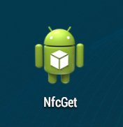
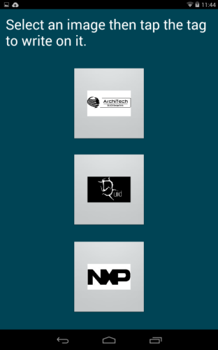
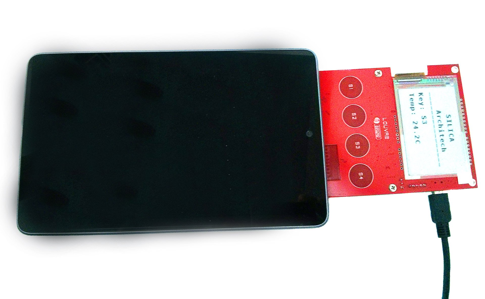
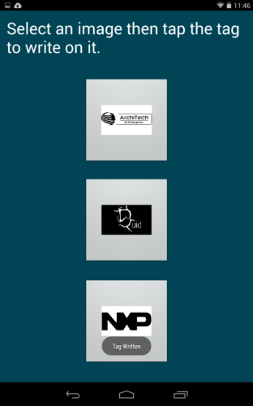

.. _quick:

Quick start guide
=================

.. warning::

	The demo have been tested with nexus tablet, in this guide we will refer to it.

Unboxing
--------

The product is supplied with the box like this:

.. image:: _images/louvre_board.jpg

And this is the content of box:

.. image:: _images/louvre_board.jpg

The board itself has been programmed with the demo.

Install Android Application
---------------------------

.. warning::

 This application works on tablet and smartphone with android system. Not all device provided by antenna NFC are suited: if the antenna is too small cannot supply enough energy required to the Louvre board to run the demo.
 However the most device in the market are capable to work with the board without problems.
 
| Now let's to see how install the application. An Android application is stored in an APK file, you must install the APK on you Android device in order to run it.
| The easiest way is to download the file from `ArchiTech website <http://www.architechboards.org/>`_ directly by your device.
| Before to start, you have to enable installing from **Unknown Sources**. To do this follow next steps:
|

1. open the **Application** menu and click on the **Settings** application.

2. Select **Applications** from the **Settings** menu

3. Check the first selection, **Unknown Sources** so you can install an APK file from a location other than the Android Market. A warning message will be desplayed, select **OK** to continue.

| Now, before to download and install the application, search for a free file manager, such as **File Manager (Explorer)** by Cheetah Mobile, and install it from the market.
| Once installed, dowload the APK file with the browser of the Android device then open **File Manager**. The program will provide a list of the SD card contents, then execute APK file clicking on APK filename.
| A new screen showing the selected application's name at the top is displayed. To install the application, just click on the **Install** button on the bottom of the screen.
| Finally, a new screen is displayed once the installation is complete and you can choose to run the application by clicking **Open** button.
|
| After installed the application we are ready to test the Louvre board with the two following demos:

Demo without Mini-USB cable
---------------------------

This demo has the purpose to show how the Louvre can run getting energy only from the NFC and the communication from the android device to the Louvre board.

1. Start the application on the android device:

2. The application displays the images that you can sent to the Louvre. Select an image do you like:

3. Lay down the tablet on the Louvre. The Android device must cover all the antenna area of the Louvre.

4. Once the data transfer is done a message is reported on the tablet. Do not remove the device from the Louvre until the e-ink display doesn't show the selected image.

Demo with Mini-USB cable
------------------------

This demo has the purpose to show the communication from the Louvre board to the android device.

1. Insert mini-usb cable from PC to the CNX connector of the board.

.. image:: _images/louvre_board.jpg

2. The Louvre display on the e-ink screen the temperature read from **SEN300** sensor and the last capacitive button pressed.

.. image:: _images/louvre_board.jpg

3. If you press a capacitive button S1, S2, S3 or S4 this will displayed on the screen.

.. image:: _images/louvre_board.jpg

4. To transfert the temperature data and the button pressed start the android application and lay down the device on the Louvre. The application display the data read.

.. image:: _images/louvre_board.jpg
