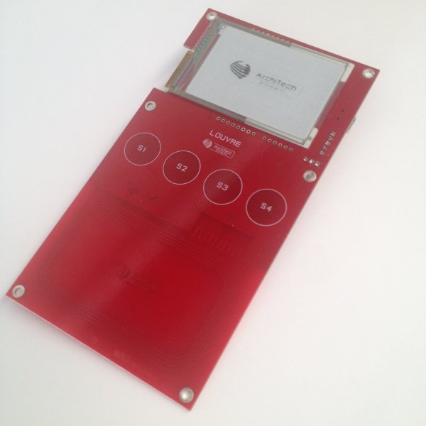

Update
======

Android Application Update
--------------------------

Firmware Update
---------------

| To update the firmware from USB you have to short the pin x CNz with pin y CNz when plug the mini-usb from the PC to the board.
| The LPC11U will run in boot mode and your PC will plug the board as a mass storage device. To update all you need is copy the new firmware in the mass storage. Obviously delete first the old one.
| 

