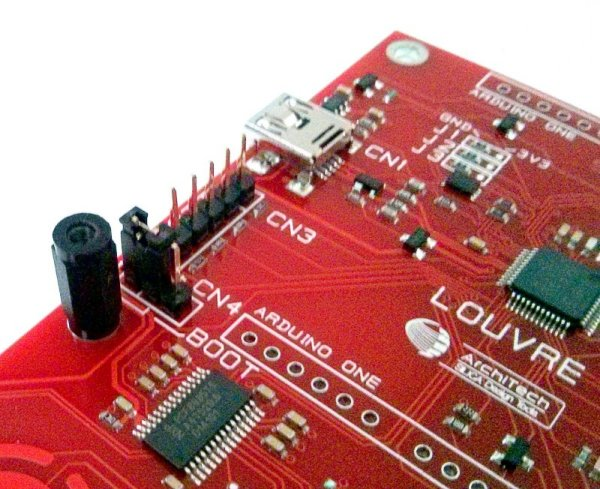
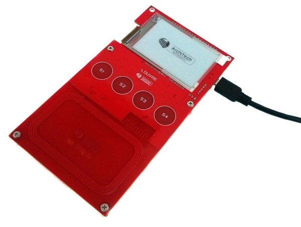

Update
======

Firmware Update by NFC (only application firmware)
--------------------------------------------------

.. important:

 | Bootloader must be present on the Louvre board.

- Use this QrCode in order to download and install the Android Updater Application on your phone. This software permits to upgrade the Louvre Application firmware.

.. image:: _images/ArchitechLouvreQR.jpg

When it is installed, launch the Updater Application and put the NFC antenna phone very close to the Louvre board.

Firmware Update by USB (bootloader & application firmware)
----------------------------------------------------------

To update the firmware from USB you have to short the pin 1 CN4 with pin 2 CN4.

Then plug the mini-usb from the PC to the board.

The LPC11U will run in boot mode and your PC will plug the board as a mass storage device. To update all you need is copy the new firmware renamed "firmware.bin" in the mass storage. Delete first the old one before to copy one newer.
 
